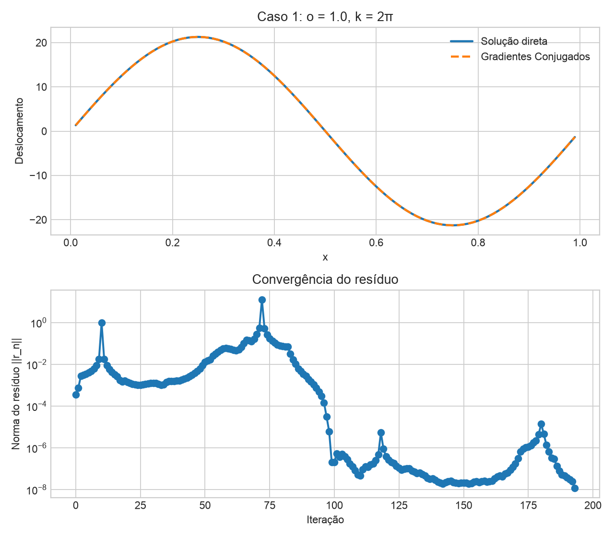
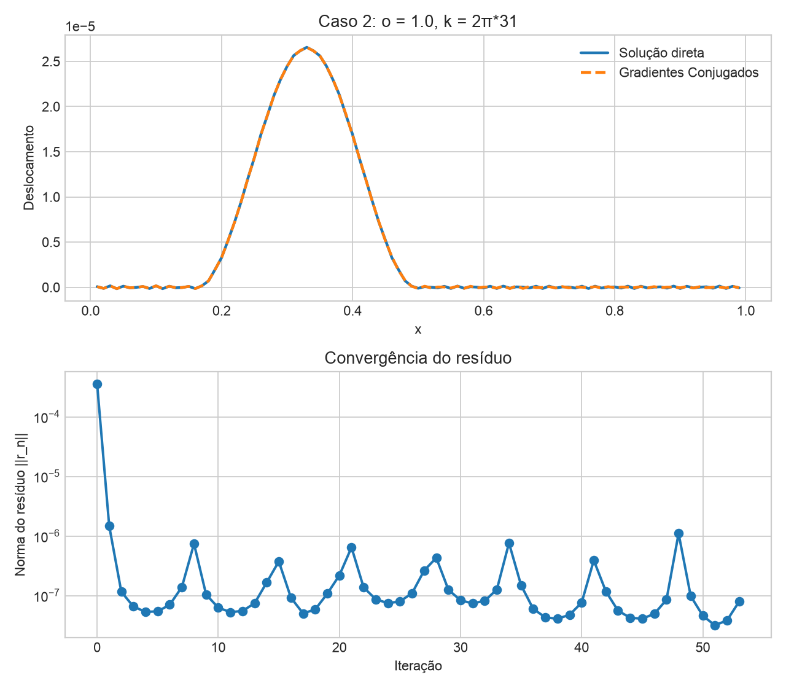
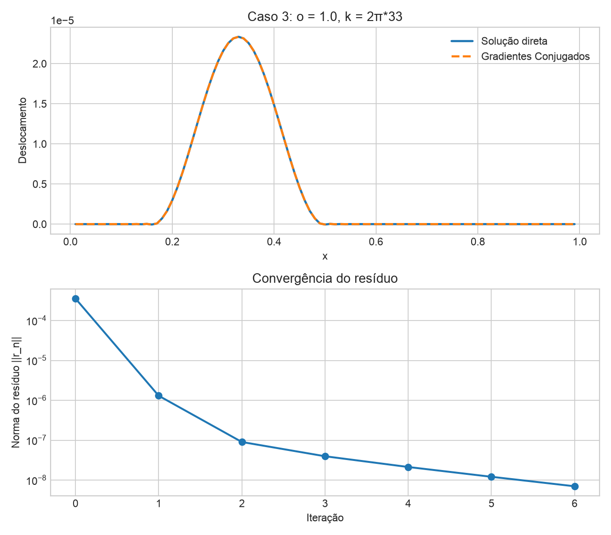
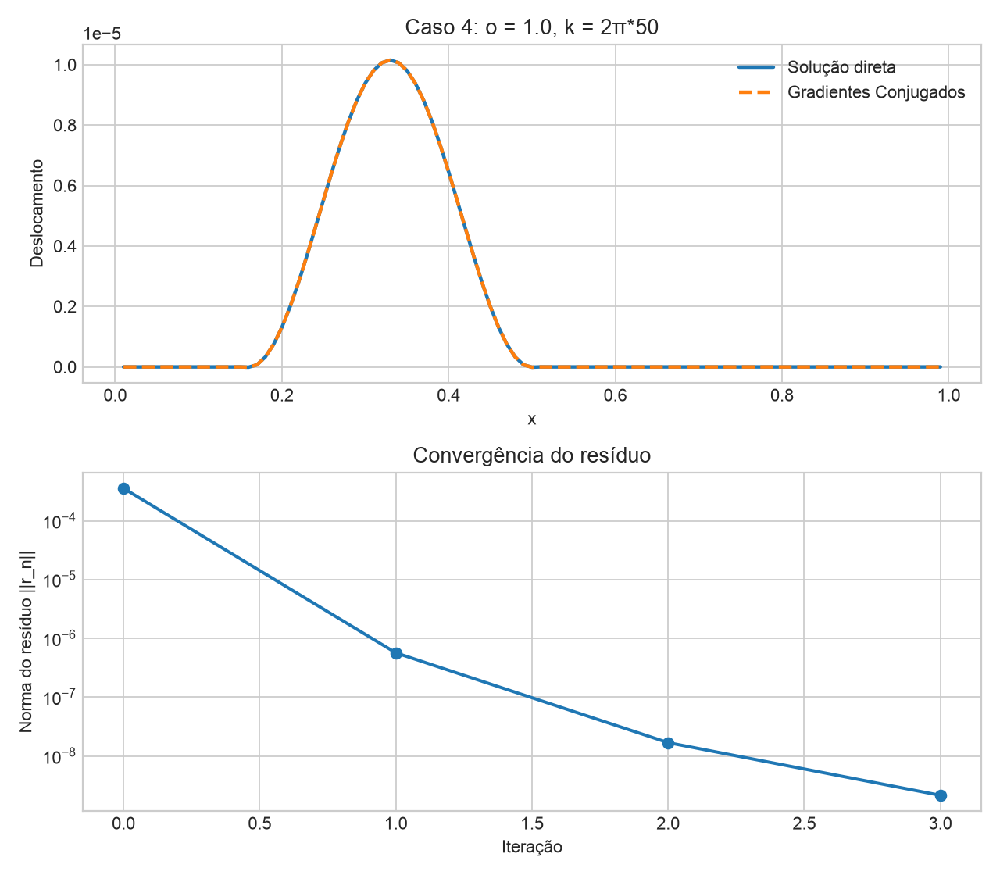
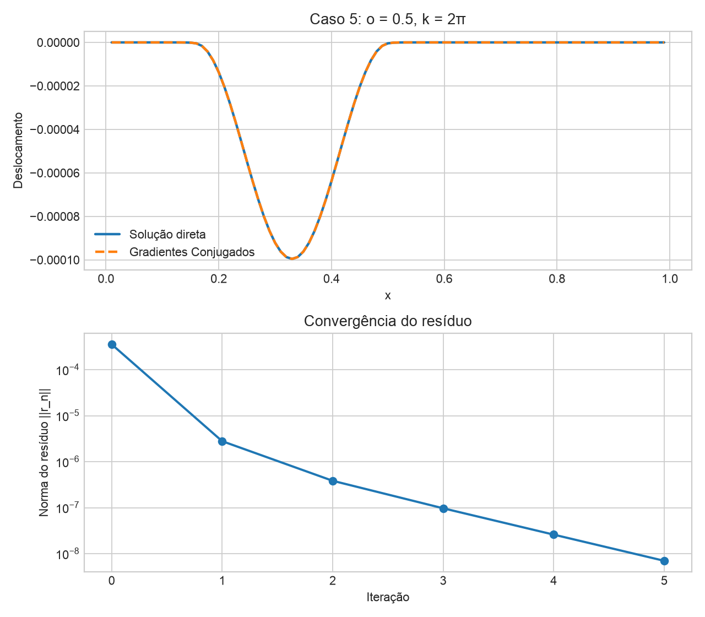
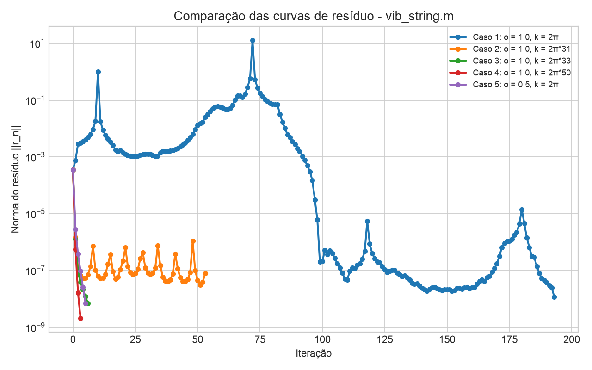

# Estudo Dirigido - Gradientes Conjugados

## Objetivo

Implementar o método iterativo dos Gradientes Conjugados conforme o algoritmo
do slide 23 do arquivo `MIT2_29S15_Lecture8 - Iterative.pdf` e rodar os casos
do exemplo `vib_string.m` mostrado nos slides 13 e 14.

O experimento anterior com matrizes aleatórias e parâmetro `tau` foi mantido no
código apenas como teste adicional. Ele não é mais o caso principal deste
estudo dirigido.

## Algoritmo implementado

Para resolver o sistema linear `Ax = b`, o método usa:

```text
v0 = r0 = b - A x0

alpha_i = (v_i^T r_i) / (v_i^T A v_i)
x_{i+1} = x_i + alpha_i v_i
r_{i+1} = r_i - alpha_i A v_i
beta_i = -(v_i^T A r_{i+1}) / (v_i^T A v_i)
v_{i+1} = r_{i+1} + beta_i v_i
```

A implementação está em `gradientes_conjugados.py`, na função
`conjugate_gradient()`.

## Reprodução do vib_string.m

O sistema linear foi construído conforme os slides 13 e 14:

- `n = 99`;
- `L = 1.0`;
- `h = L/(n+1) = 0.01`;
- malha `x = [h, 2h, ..., L-h]`;
- matriz tridiagonal `A`;
- diagonal principal igual a `(k*h)^2 - 2`;
- diagonais superior e inferior iguais a `o`;
- vetor de força `f` com janela de Hanning:
  `f(nw1:nw2) = h^2*hanning(nw2-nw1+1)`.

As funções principais são:

- `build_vib_string_case()`: monta a matriz, a malha e o vetor de força;
- `conjugate_gradient()`: implementa o método dos Gradientes Conjugados;
- `run_cases()`: roda os cinco casos dos slides;
- `plot_results()`: gera gráficos com solução direta, solução CG e resíduos.

## Casos executados

Foram rodados os casos:

- `o = 1.0`, `k = 2π`, `h = 0.01`;
- `o = 1.0`, `k = 2π*31`, `h = 0.01`;
- `o = 1.0`, `k = 2π*33`, `h = 0.01`;
- `o = 1.0`, `k = 2π*50`, `h = 0.01`;
- `o = 0.5`, `k = 2π`, `h = 0.01`.

Para cada caso, foi calculado:

- se a matriz é simétrica;
- se a matriz é definida positiva;
- menor autovalor;
- número de iterações do CG;
- norma final do resíduo.

## Gráficos

Cada gráfico de caso compara a solução direta (`numpy.linalg.solve`) com a
solução obtida por Gradientes Conjugados e também mostra a curva da norma do
resíduo por iteração.













## Resultados

| Caso | Simétrica | Definida positiva | Menor autovalor | Iterações | Norma final do resíduo |
| --- | --- | --- | ---: | ---: | ---: |
| `o = 1.0, k = 2π` | sim | não | `-3.995065e+00` | 193 | `1.198815e-08` |
| `o = 1.0, k = 2π*31` | sim | não | `-2.051372e-01` | 53 | `7.998496e-08` |
| `o = 1.0, k = 2π*33` | sim | sim | `3.001866e-01` | 6 | `7.030115e-09` |
| `o = 1.0, k = 2π*50` | sim | sim | `5.870591e+00` | 3 | `2.146587e-09` |
| `o = 0.5, k = 2π` | sim | não | `-2.995559e+00` | 5 | `7.008882e-09` |

## Análise

O Método dos Gradientes Conjugados, como apresentado no slide 23, tem garantia
teórica para matrizes simétricas definidas positivas. Todos os casos do
`vib_string.m` geram matrizes simétricas, mas nem todos geram matrizes definidas
positivas.

Nos casos `k = 2π*33` e `k = 2π*50`, a matriz é definida positiva. Nesses dois
casos, o método converge em poucas iterações e a solução por Gradientes
Conjugados coincide visualmente com a solução direta.

Nos casos `k = 2π`, `k = 2π*31` e `o = 0.5, k = 2π`, a matriz não é definida
positiva porque possui menor autovalor negativo. Assim, o método não está dentro
da hipótese teórica principal, embora numericamente ainda tenha produzido uma
aproximação com resíduo final pequeno para estes testes.

## Conclusão

O exemplo `vib_string.m` gera matrizes simétricas em todos os casos, porém nem
todas são definidas positivas. O método dos Gradientes Conjugados possui
garantia teórica de convergência apenas para matrizes simétricas definidas
positivas. Nos casos em que essa condição foi satisfeita (`k = 2π*33` e
`k = 2π*50`), o método convergiu em poucas iterações e reproduziu a solução
direta com alta precisão. Nos demais casos, embora o algoritmo tenha produzido
uma aproximação e reduzido o resíduo, esses resultados devem ser interpretados
com cautela, pois a convergência não é garantida pela teoria.
